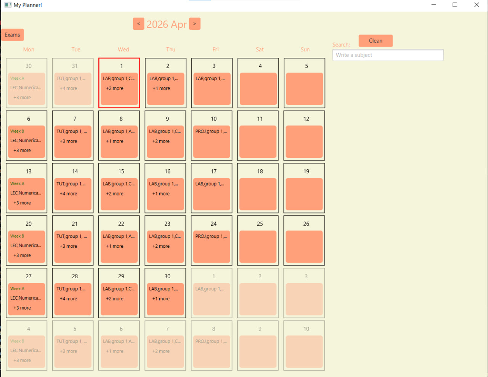

# Student Planner Application 📅

A desktop application designed for students to efficiently manage their schedules, classes, and exams. Built with Java and JavaFX, this project demonstrates practical skills in desktop application development, UI design, backend logic, and data handling.

 
## 🚀 Features

* **Interactive Calendar:** An intuitive grid-based calendar interface for navigating through months and years.
* **Schedule Management:** Easily distinguish between different types of classes (Lectures, Labs, Projects, Tutorials) using visual cues and color coding.
* [cite_start]**Exam Tracking:** A dedicated section to manage and view upcoming exams[cite: 89, 94].
* **Search Functionality:** Quickly find specific subjects or classes within your schedule using the built-in search bar.
* [cite_start]**Persistent Storage:** User plans and exam schedules are persistently saved and loaded from local text files (`user_plans.txt`, `egzaminy.txt`)[cite: 61, 98].
* [cite_start]**Custom Styling:** Clean and modern UI styled with custom CSS (`details_window.css`)[cite: 94].

## 🛠️ Technologies Used

* [cite_start]**Language:** Java (JDK 17+) [cite: 61]
* **Framework:** JavaFX (UI Development)
* [cite_start]**Build Tool:** Maven [cite: 74]
* [cite_start]**Design:** FXML / Scene Builder [cite: 94, 96]
* **IDE:** IntelliJ IDEA / VS Code 

## 📁 Project Structure

* [cite_start]`src/main/java/com/example/demo/` - Core Java source code[cite: 98].
  * [cite_start]`Main.java` - The entry point of the application[cite: 93].
  * [cite_start]`CalendarController.java` - Handles the logic and user interactions for the main calendar view[cite: 76].
  * [cite_start]`ExamsController.java` - Manages the logic for the exams view[cite: 89].
  * [cite_start]`Exam.java` - Data model representing exam objects[cite: 89].
* [cite_start]`src/main/resources/com/example/demo/` - UI definitions and styling[cite: 98].
  * [cite_start]`hello-view.fxml` & `ExamsView.fxml` - Define the layout of the application's screens[cite: 94, 96].
  * [cite_start]`details_window.css` - Custom styling for the application's components[cite: 94].

## ⚙️ How to Run

1. **Clone the repository:**
   ```bash
   git clone [https://github.com/Ostap4/Student-Planner.git](https://github.com/Ostap4/Student-Planner.git)
